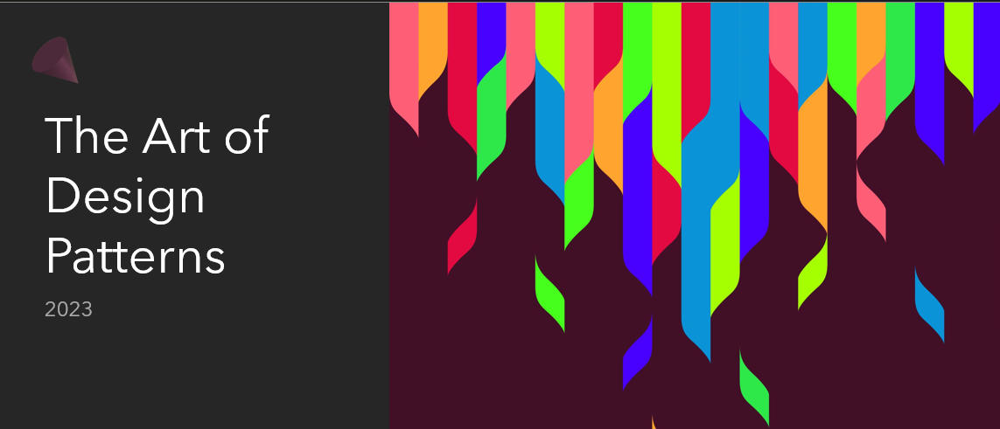
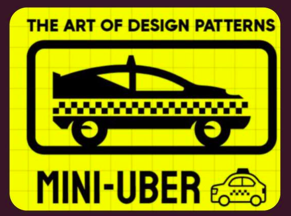

# The Art Of Design Patterns, FCIS - ASU 2023 Summer Training

## Introduction

This repository contains the sessions and challenges of the summer training 2023 at the Faculty of Computers and Information Sciences, Ain Shams University.

The training was hosted by Science and Tech committee of [@Open Source Community](https://github.com/orgs/Open-Source-Community) at FCIS - ASU's Saeed AbdelWahab hall, and it was prepared by the S&T head Mohamed Samy and members of OSC S&T 23' committee.

The training was about the art of design patterns, and it was divided into 7 sessions, some sessions has a challenge that you can find in the `Challenges` folder.

## Table of Contents

- [Session 1](./Sessions/Lec1%20-%20Intro,%20OOP,%20UML%20and%20SOLID%20Principles.pptx): OOP Recap, Design Principles & SOLID
  - [MCQ Challenge 1 + Answers](./Challenges/Session%201%20Challenge%20&%20Answers.pdf)
- [Session 2](./Sessions/Lec2%20-%20Creational%20Design%20Patterns.pptx): Creational Design Patterns
  - [Hands On Solution](./Challenges/AbstractFactoryHandsOn.java)
- [Session 3](./Sessions/Lec3%20-%20Structural%20design%20patterns.pptx): Structural Design Patterns
    - [Extra challenge](./Challenges/Extra%20Challenge/)
- [Session 4](./Sessions/Lec4%20-%20Behavioral%20Design%20Patterns.pptx): Behavioral Design Patterns
- [Session 5](./Sessions/Lec5%20-%20Refactoring%20&%20Clean%20Code%20I.pptx): Refactoring & Clean Code I
- [Session 6](./Sessions/Lec6%20-%20Refactoring%20&%20Clean%20Code%20II.pptx): Refactoring & Clean Code II
  - [MCQ Challenge 2 + Answers](./Challenges/LEC6-Questions+Answers.pdf)
- Session 7: Project evaluation (No Slides)

## Recorded sessions:

- [Session 1 & 2](https://drive.google.com/drive/folders/1EoyToS6OJfvEbm2toDP1JMlzOzU05s_s)

## Project details and evaluation

### The Art of Design Patterns Mini uber:

 <em>The Art of Design Patterns Mini uber</em> 

You should deliver a project with the following functionality (more details in session 1)

Requirements:

1- Login / Register
2- DB or Files
3- Request Rides
4- Payments
5- Many Ride Types Normal,  Premium, Bus, Motorbike
6- Support Tickets (customer care)
7- Many Routing algorithms (can be trivial like : price = distance*2)

Evaluation critiria:

1 - Applying SOLID principles

2- Using Suitable design patterns for each use case

3- No unnecessary usage of design patterns (KISS: Keep It Simple, Stupid)

4- No unnecessary / unused code (YAGNI)

5- Sticking to languages' Coding conventions

6- Overall clean and readable code

7- GUI is a plus

8- Any Extra functionality / Ideas is a plus

9- The whole team should be aware of the architecture and ready to be asked about any part

## Credits

Sessions and summer training were prepared by:

- [@Mohamed Samy](https://github.com/Mohamed-Samy26) S&T Head 23'
- [@Mazen Bakr](https://github.com/IX0XI) S&T Vice Head 23'
- [@Mahmoud Mohamed](https://github.com/mahmoudmmo)
- [@Mariem Ahmed](https://github.com/MariamAhmeddd)
- [@Tasneem Bahaa](https://github.com/Tasn-eEm)
